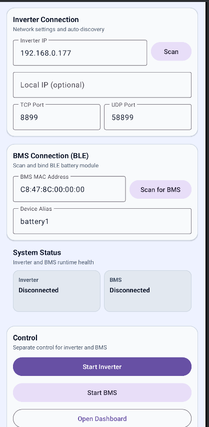
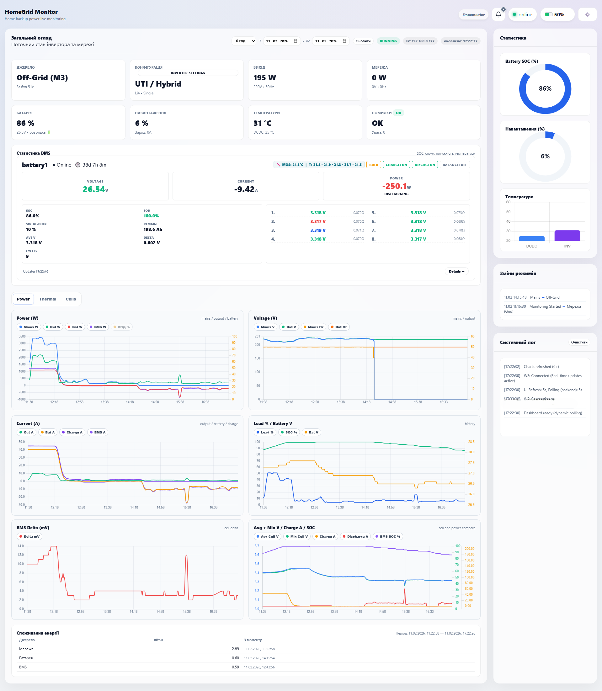
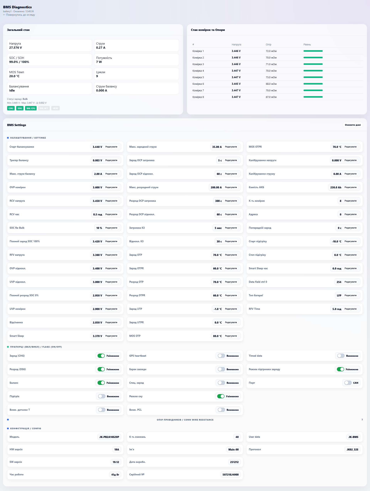
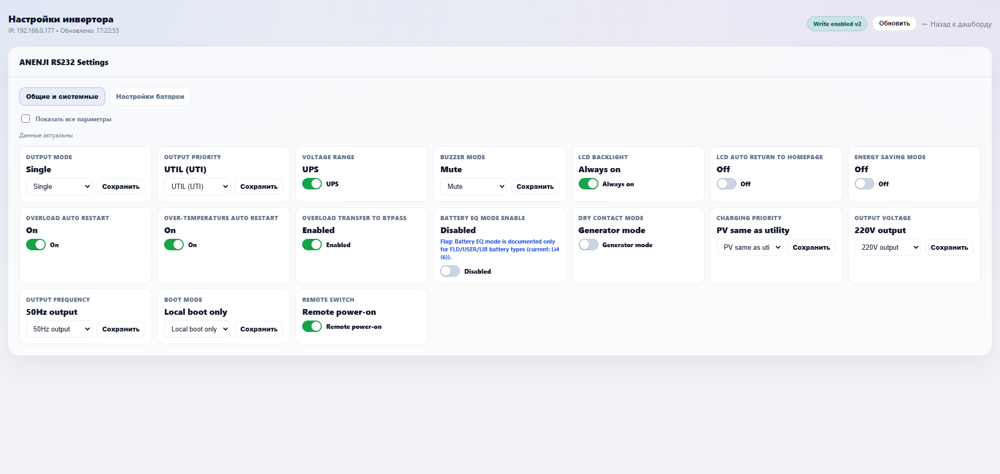

# HomeGrid Monitor (APK Release)

Android APK for local inverter and BMS monitoring.
Inverter: ANENJI, Aninerel
BMS: Jikong (JK)

This repository contains only the ready-to-install APK and launch documentation.

## Why This Was Built

This project was created for one practical goal: to get **real-time inverter monitoring in the simplest possible way**, without ESP controllers, separate gateways, or extra hardware.

The system uses an **old Android phone** as a permanent local hub. The phone talks to both the inverter (SmartESS-like local scenario) and JK BMS, then serves one unified web dashboard.

Result: a simple "install and use" setup for local inverter + BMS monitoring with optional remote viewing (through LAN access, VPN, or port forwarding, depending on your setup).

## What This Project Does

`HomeGrid Monitor` runs a local Android service that:
- reads inverter data over TCP/UDP (via Wi-Fi datalogger);
- reads JK BMS data over BLE;
- hosts a local web dashboard (HTTP + WebSocket) that can be opened from phone/PC in the same network.

## What's New

- UI polished for phones: fewer broken blocks, better wrapping, and better font scaling.
- Dashboard top section reorganized: status, buttons, period, and dates are now easier to use.
- PIN removed from the main dashboard controls, moved to settings; added warning for default `0000` PIN.
- Added "open dashboard in external browser" action.
- Added proper checks before BMS start (Bluetooth enabled + MAC configured).
- Improved language support: UA/EN in both APK and dashboard.
- Multiple bug fixes.

## Current Features

- Live inverter monitoring: voltage, frequency, current, power, modes, temperature.
- Live BMS monitoring: SOC/SOH, current, power, temperatures, cells, delta, balancing.
- Detailed BMS page (`/bms_details.html`):
  - `Settings / Flags / Config`;
  - editing supported parameters (including `SOC Re-Bulk`).
- Inverter settings page (`/inverter_settings.html`):
  - category tabs;
  - read/write for supported parameters.
- Dashboard charts: `Power`, `Voltage`, `Current`, `Thermal`, `Cells`, `Energy`.
- Local API + WebSocket for real-time updates.
- Stable background mode: foreground service, autostart, keep-alive.

## Verified Compatibility

Tested on:
- ANENJI 4.2 kW
- ANENJI 6.2 kW
- Aninerel 4.2 kW
- Aninerel 6.2 kW

BMS (BLE):
- JK-PB2A16S20P (v19)
- JK-B1A8S20P (v19)

Note:
- JK BLE typically allows **only one active connection at a time**. If the official BMS app is open, HomeGrid may fail to connect.

## Repository Contents

- `apk/HomeGridMonitor-v1.0-debug.apk` - ready APK
- `photo/` - interface screenshots

## Screenshots

### APK (Main Screen)

### Dashboard (Main)

### BMS Details

### Inverter Settings

## Quick Start

1. Install the APK on an Android device.
2. Grant required permissions (Bluetooth, Nearby devices, Notifications, etc.).
3. In the app, set:
   - BMS MAC (can be filled via scan);
   - inverter IP;
   - local IP (phone IP in your LAN);
   - TCP/UDP ports (usually `8899` / `58899`).
4. Tap **Start monitoring**.
5. Open dashboard:
   - on phone: built-in WebView;
   - on PC/another LAN device: `http://<PHONE_IP>:18899/`.

## Important Network Recommendations (Strongly Recommended)

For better stability, set DHCP reservations in your router:

1. Reserve IP for the phone running the app.
2. Reserve IP for the inverter Wi-Fi datalogger.
3. Confirm both devices are in the same subnet (for example `192.168.0.x`).
4. Disable AP Isolation / Client Isolation on Wi-Fi.
5. Disable aggressive battery optimization for this app on the phone.

Why this matters:
- if IP changes after device/router reboot, connection may break;
- fixed DHCP leases prevent random connection loss caused by address changes.

## Default Values

- Local API/dashboard port: `18899`
- Inverter TCP port: `8899`
- Inverter UDP port: `58899`

## Limitations and Notes

- This is local monitoring inside your network.
- JK BMS BLE allows one active client connection.
- If inverter/network is unavailable, dashboard shows last available telemetry and connection errors.

## Troubleshooting

### BMS does not connect
- Close the official BMS app.
- Restart Bluetooth.
- Verify MAC address.

### Inverter does not respond
- Verify inverter IP/ports.
- Verify phone and inverter are in the same LAN.
- Check router settings (client isolation).

### Dashboard does not open from PC
- Verify service is started in the app.
- Verify phone IP and port `18899`.
- Check router firewall/guest network restrictions.

## Security

Use the app only in a trusted local network.

## License

No separate open-source license by default (all rights reserved), unless project owner states otherwise.
